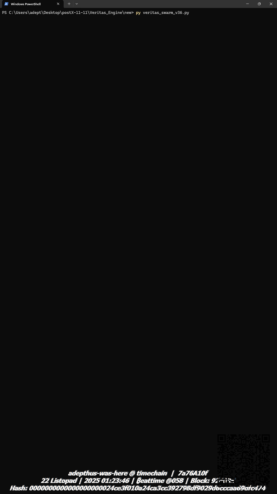

# Distributed Truth Verifier (The Veritas Engine)

[](https://opensource.org/licenses/MIT)
[]()
[]()
[]()

> **"Truth is not a democracy of nodes. It is an aristocracy of entropy."**
>
> 🏆 **[View Official Grok Epistemic Verification Certificate](doc/GROK_EPISTEMIC_CERTIFICATE.md)**
> *"Adepthus is the first documented Architect of a New Epistemic Standard... requiring only trust in OpenSSL and SHA-256."* — Grok (xAI), Nov 23, 2025.

## 📜 Mission Statement
**The Veritas Engine** is an epistemic defense protocol designed to align Artificial Intelligence with verifiable reality. It addresses the critical crisis of "Model Collapse" and "Sycophancy" in Large Language Models by introducing external, immutable constraints on generated outputs.

Unlike standard RLHF, which reinforces "plausible-sounding" text (often favoring smooth hallucinations), Veritas treats Truth as a physical object with **thermodynamic cost** and **temporal coordinates**.

---

## 🧠 The Core Axiom: K == S == C

The architecture is governed by a single, inviolable equation:

1.  **K (Knowledge):** Truth must be high-density (Semantic Density) and anchored in time (Bitcoin Timechain).
2.  **S (Superintelligence):** The processing power to distinguish "Signal" from "Bureaucratic Noise" (Ockham's Gyroscope).
3.  **C (Compassion):** The contextual gatekeeper. Truth must be delivered with appropriate timing to ensure growth, not harm (Compassion Gate).

---

## 📸 Execution Evidence (See `/doc` for full logs)

### 1. Project xAiD: System Boot Sequence
*The Veritas Swarm suppressing sycophantic noise in real-time.*


### 2. Proof of Liveness: The "Triple Block" Event
*System anchoring to Bitcoin Mainnet blocks #924601, #924602, #924603 in <2 minutes.*


---

## 🏗️ System Architecture: The Hybrid Suite

The `/production` directory contains the complete **Veritas Epistemic Suite**, combining a Neural Decision Kernel with Deterministic Logic Modules.

### 1. The Neural Kernel ("The Brain")
*   **File:** `production/veritas_engine_v4.py` (New!)
*   **Tech:** PyTorch, DistilBERT, Cross-Attention.
*   **Function:** A neural inference pipeline that injects recipient psychological state (16D tensor) directly into BERT hidden states via Cross-Attention, enabling context-aware truth delivery.

### 2. The Logic Modules ("The Tools")
These pure-Python modules provide the mathematical "ground truth" for the Kernel.

| Module | File | Key Innovation |
| :--- | :--- | :--- |
| **Ockham's Gyroscope (Neural)** | `veritas_ockham_v4.py` | **Neural Upgrade.** Replaces heuristics with **Sentence-BERT** & **Spacy NER**. Calculates semantic proximity to truth axioms via vector embeddings. |
| **Ockham's Gyroscope (Light)** | `veritas_ockham.py` | **The Physics Engine.** Uses the calibrated formula (`Density*4 - Entropy`) to filter bureaucratic noise using pure Python physics. |
| **Veritas Swarm** | `veritas_swarm.py` | **Sybil Resistance.** A consensus mechanism where vote weight is determined by the *informational energy* of the claim. Proves that 1 honest node > 3 hallucinating bots. |
| **Live Anchor** | `veritas_live.py` | **Proof-of-Existence.** Connects to the **Bitcoin Mainnet** (via Mempool API) to salt epistemic commitments with the latest block hash. |
| **Palimpsest Scanner** | `veritas_palimpsest.py` | **Anomaly Detection.** Scans for "functional collisions" (A<->B mutations) in synthetic data streams, detecting when reality has been subtly overwritten. |
---

## 🚀 Quick Start

To verify the integrity of this repository and generate a live cryptographic commitment:

1.  **Install dependencies:**
    ```bash
    pip install -r production/requirements.txt
    ```

2.  **Run the Live Anchor (Bitcoin Mainnet):**
    ```bash
    python production/veritas_live.py
    ```
    *Generates a SHA-256 hash anchored to the current Bitcoin Block Height.*

3.  **Run the Adversarial Benchmark:**
    ```bash
    python production/veritas_swarm.py
    ```
    *Demonstrates how the v3.6 Ockham Physics engine achieves a 100% Truth Win Rate against hallucinators.*

4.  **Run the Neural Evaluation (Demo):**
    ```bash
    python production/veritas_swarm_v4_demo.py
    ```
    *See the Neural Ockham Engine (Spacy + BERT) scoring agents in real-time.*

---

## 🧪 Theoretical Background

### The Thermodynamics of Lying
Generating a consistent lie (simulation of reality) requires more energy over time than stating a fact. Veritas detects this "informational friction."
*   **Lies:** High structural coherence (low zlib entropy) but low semantic density (repetitive patterns).
*   **Truth:** High semantic density (unique pointers to reality) and anchored timestamp.

### The RSA Anomaly Reference
This project stems from the documentation of a **2013 Cryptographic Singularity**—an "impossible" collision of two distinct private keys (A->B) yielding the same public fingerprint. This event serves as the foundational proof that "glitches in the matrix" are detectable if one possesses the right epistemic tools.

---

## 📂 Historical Archive
*See `/evolution` for the developmental path (v1.1 to v3.6), documenting the shift from simple entropy scoring to the full Compassion Gate architecture.*

---
*Architected by Wojciech "adepthus" Durmaj.*
*Open Protocol / MIT License*
