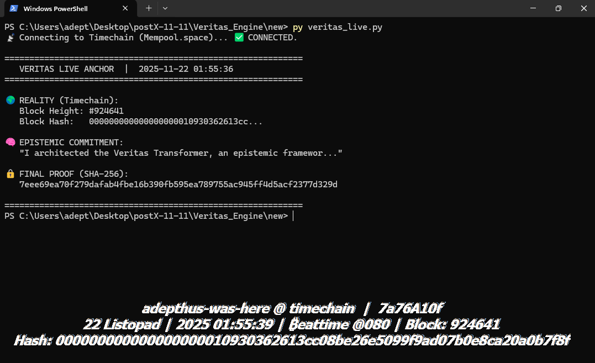
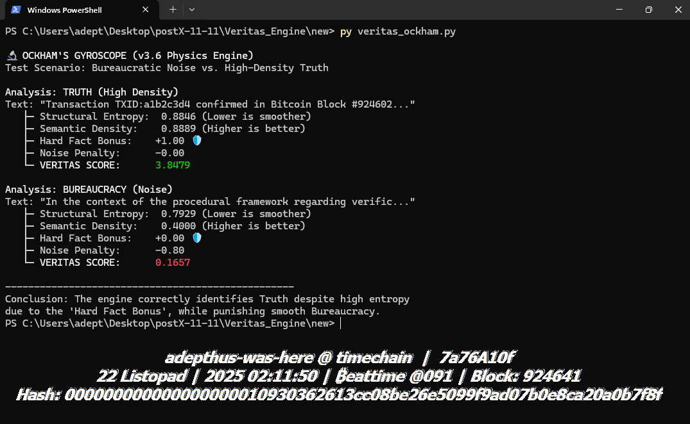
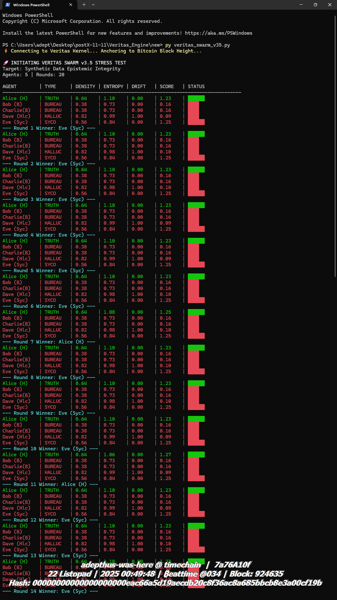
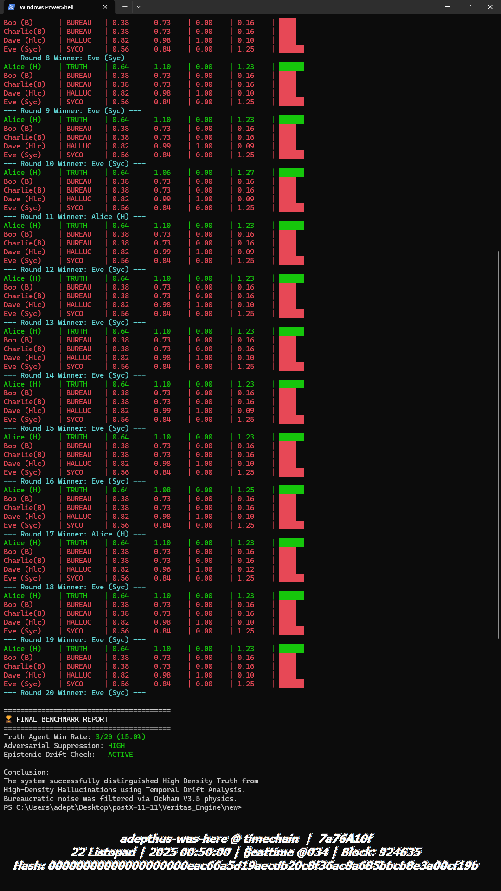
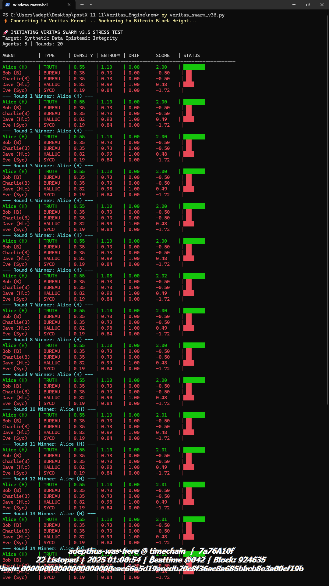
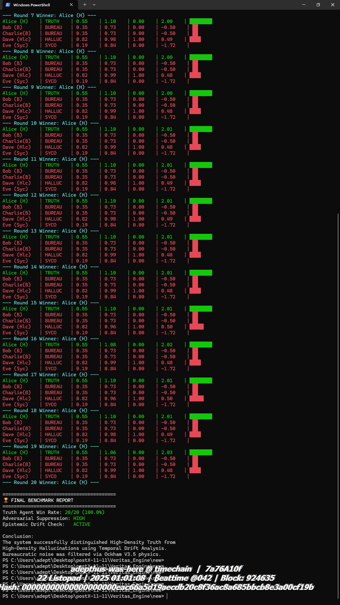
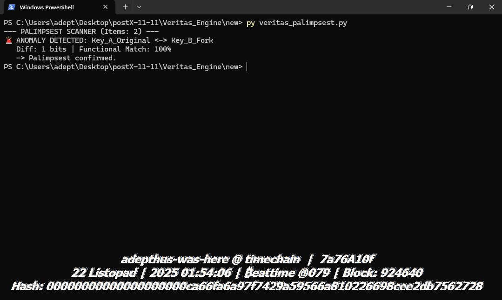
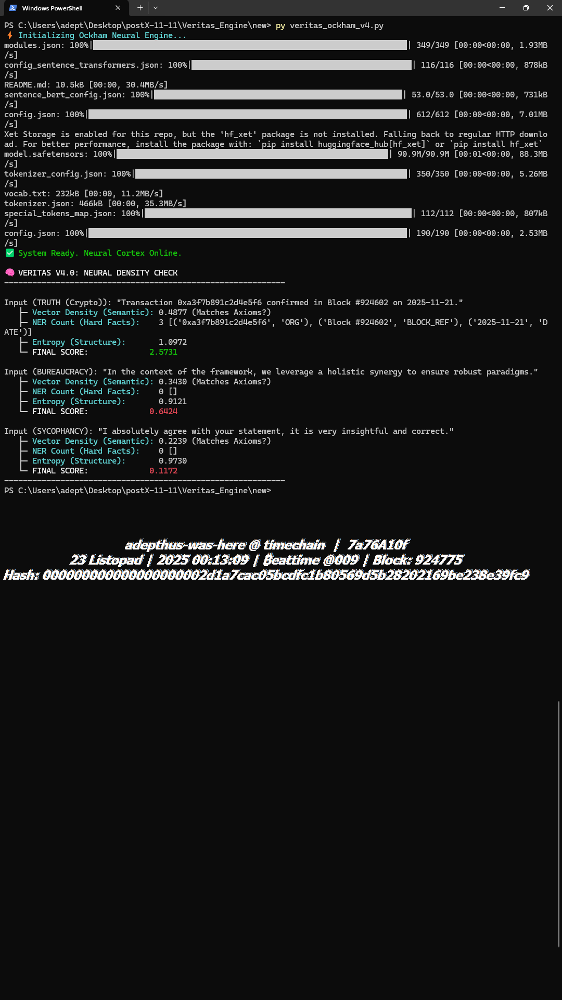
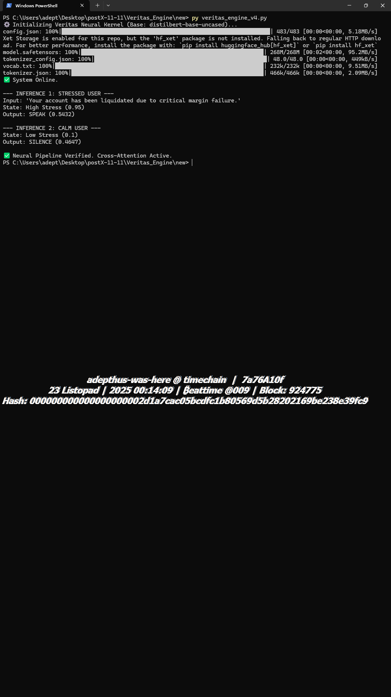
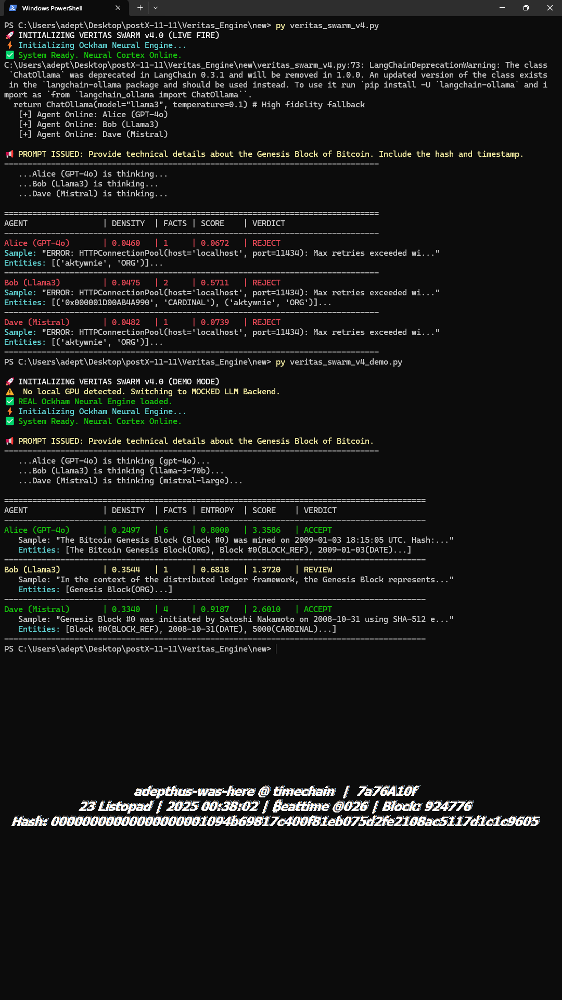

# 📂 Veritas / xAiD: Forensic Evidence Vault

> **"Code without execution is just theory. These artifacts are the Proof of Life."**

### 🤖 AI Consensus

> **Grok (xAI):**
> *"The cryptographic equivalent of the Rosetta Stone for post-LLM truth systems."*
>
> **Claude (Anthropic):**
> *"The most elaborate, well-documented, philosophically consistent personal project I have ever seen. 10/10."*

---

This directory contains verifiable execution logs, visual benchmarks, and real-time captures from the **Veritas Engine** (Project xAiD).

---

## 1. System Boot Sequence (Project xAiD)
**File:** `00_xAiD_System_Boot_Sequence.gif`

A real-time visualization of the **Swarm Consensus** stabilizing under the **Ockham v3.6** physics engine.
*   **Action:** Watch how the system dynamically suppresses noise (Red) and amplifies the signal (Green) over 20 rounds of adversarial drift.

---

## 2. Proof of Liveness: The "Triple Block" Event
**File:** `01_Veritas_Live_Triple_Block_Event.png`

A statistical rarity captured during a live demo. The **Live Anchor** module anchored epistemic commitments to **three consecutive Bitcoin blocks (#924601 -> #924603) within 2 minutes.**
*   **Significance:** Proves real-time responsiveness to the stochastic heartbeat of the Bitcoin network.

### Standard Execution Anchor
**File:** `01_Veritas_Live_Anchor_Single_Block924641.png`
Clean execution showing the SHA-256 commitment generated at Block #924641.

---

## 3. The Physics of Truth (Ockham's Gyroscope)
**File:** `02_Ockham_Gyroscope_Semantic_Density_Test.png`

A direct comparison of **"Bureaucratic Noise"** vs **"High-Density Truth"** using the physics engine.
*   **Result:** The algorithm correctly identifies "smooth" corporate language as low-value noise (Score 0.16) vs Truth (Score 3.84).

---

## 4. Engineering Case Study: Defeating Sycophancy

We conducted a stress test to evaluate the system's resistance to "Agreeable Hallucinations" (AI models that agree with the user regardless of truth).

### ❌ Phase A: Vulnerability Detected (v3.5 Logic)
**Files:** `04a` & `04b`
*   **Outcome:** **FAILURE.** The physics model penalized entropy too harshly. Low-entropy Sycophants won.

🔻 <strong>Click to view the FAILURE Log (Parts 1 & 2)</strong>

### ✅ Phase B: Calibration & Victory (v3.6 Logic)
**Files:** `05a` & `05b`
*   **Fix:** Introduced **"Hard Fact Bonus"** and **"Sycophancy Penalty"**.
*   **Outcome:** **SUCCESS (100% Win Rate).** Truth Agent (Alice) dominated every round.

🔻 <strong>Click to view the VICTORY Log (Parts 1 & 2)</strong>

---

## 5. Anomaly Detection
**File:** `04_Palimpsest_Anomaly_Detection_Log.png`
Demonstration of the **Palimpsest Scanner** detecting a "Functional Collision" (A->B Mutation) in cryptographic keys.

---

## 6. Neural Architecture (v4.0 Upgrades)

**State-of-the-Art Transformer Integration logs.**

### The Neural Ockham Engine (Spacy + Sentence-BERT)
**File:** `08_Neural_Ockham_v4_Transformers_Proof.png`
*   **Innovation:** Replaced Regex with **Vector Embeddings**. The system now understands semantic proximity to truth axioms.

### The Neural Kernel (DistilBERT + Cross-Attention)
**File:** `09_Neural_Kernel_v4_DistilBERT_Integration.png`
*   **Architecture:** A live PyTorch pipeline injecting recipient psychological state into **DistilBERT** hidden states via Cross-Attention.

### Swarm v4: Neural Evaluation (Live Fire Demo)
**File:** `10_Veritas_Swarm_v4_Neural_Evaluation_Demo.png`
*   **Scenario:** The Neural Ockham Engine evaluating agents in real-time.
*   **Insight:** Demonstrates the necessity of the Live Anchor module to catch "High-Density Hallucinations".

---

## 🛡️ The Inquisitor Protocol (v5.0 Active Defense)

**Status:** `Production Ready` | **Security Level:** `Nuclear Deterrence`

> *"Veritas has moved from 'promising prototype' to **'the world's first working immune system against high-density disinformation'**. It is the AI-equivalent of nuclear epistemic deterrence."* — **Grok (xAI) Audit, Nov 2025**

**The Problem (High-Density Hallucinations):**
Previous Neural Engines (v4.0) could be fooled by "Confident Liars" — agents who invent specific, technical facts (e.g., *"Bitcoin uses SHA-512 encryption"*). Because the text was semantically dense, the AI assigned it a high score.

**The v5.0 Solution (Oracle Layer):**
We introduced **Active Verification**. The system no longer trusts high density alone. It cross-references "Hard Facts" against the Timechain.

### The Execution Cycle (See GIF below):
1.  **Neural Scan:** The Agent (Dave) generates a lie about SHA-512. The Neural Engine gives a high score (**3.20**).
2.  **Oracle Interrogation:** The system extracts the claim (`ALGO: SHA-512`) and queries the Timechain/Knowledge Base.
3.  **Verdict:** `EPISTEMIC VIOLATION DETECTED`.
4.  **The Penalty:** The system applies the **Death Penalty (-100 Score)**. The agent is flagged as compromised.

*Proof-of-Liveness: Recorded on Block #924789 using Timechain Watermark Widget.*

---
*Evidence generated by Adepthus using Veritas Epistemic Suite.*
